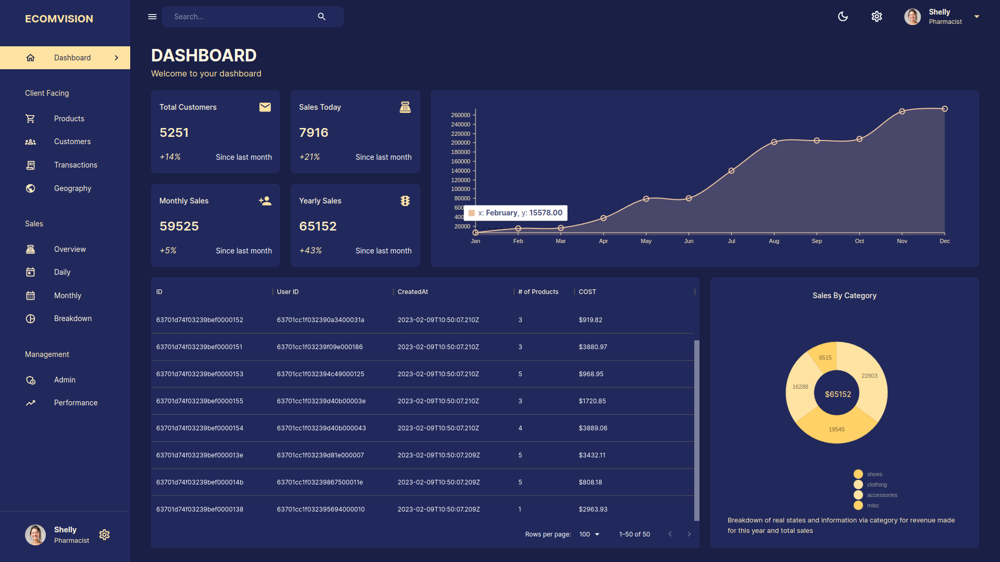

# ADMIN DASHBOARD

_The application is currently hosted on render.com, and it may require a few minutes for the APIs to fully load. Your patience is greatly appreciated during this process._

The Front End component of the complete admin dashboard project is designed to assist administrators in managing their teams by filtering and organizing relevant information. The front-end development was accomplished using React, material UI, and Redux-toolkit. The backend was built with Node, Express, and MongoDB, and Passport was employed to establish authentication. Presently, only super admins are authorized to access the dashboard, which offers both dark and light mode options.

The process of creating this product involves utilizing several technologies, specifically React JS, Material UI, and Redux-toolkit. Material UI simplifies styling for the React front-end, while Redux-toolkit facilitates state management. Additionally, API calls are streamlined into a single location using redux-toolkit query.

In order to complete the development of this product, several additional technologies were also utilized, including Node JS, Express JS, and MongoDB. Node JS and Express JS were employed to create the backend of the application, while MongoDB was selected as the database management system. With these technologies, the product is equipped to effectively manage state and data on both the front-end and back-end.

